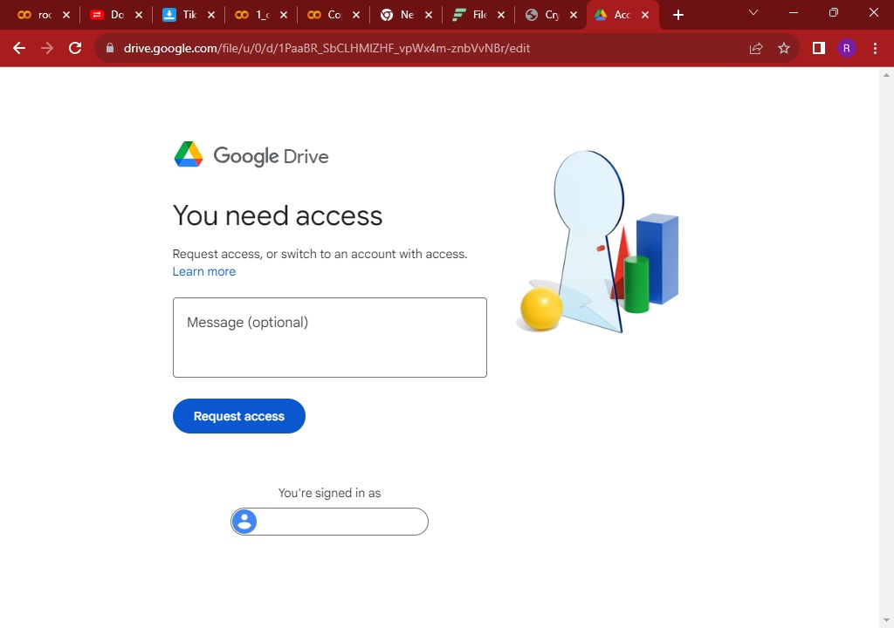

# Deep_Fake-FaceSwap-

[](https://git.io/typing-svg)


 


- First you need to Copy and Past the below link in your Browser.

````
https://colab.research.google.com/drive/1PaaBR_SbCLHMlZHF_vpWx4m-znbVvNBr#scrollTo=G9BdiCppV6AS
````

- Then you will be redirected to an interface like this 👇

  

- Now you can send me a request here and in addition follow me on github and star this repo and take a screenshot and inbox me on 
  whatsapp along with the gmail where you have sent your access request.
  
  **here is my whatsapp number https://wa.link/9oyvrj**

-  Then I will approve your request after considering your screenshots.
-  Now you need to click the above link again or refresh the page.
-  Now you will be able to see an interface like this.
  
  

- Now click the Connect button (it will take few seconds)
  
- After Connected Now you need to Run Cell CMD 1 by clicking the play button (This is compulsory)

  


- Now You need to upload your Target Video(.mp4) & Target image(.jpg) by clicking file icon in left side.

    
  
    

- **plz rename your video as video.mp4 & image as image.jpg** like this 👇
 
    
  

- Now you need to run cell CMD 2 or cell CMD 3 ( this depend on your choice )
    **( Cell CMD 2 has Low quality & Cell CMD 3 has High quality )**


  

  After Process Completed the out put will apear hear ...

  

  **Enjoy the Tool , Have FUN 😂**

  [](https://git.io/typing-svg)
  

  


